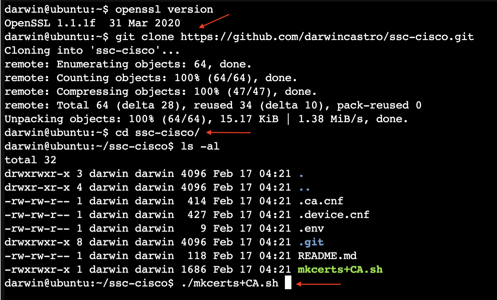

# Cisco Self-Signed Certificate GSenerator
 🚧 Work In-Progress 🚧

Script used to create a CA, and self-signed certificates for Cisco devices, it could be use for other network devices as well.

We are going to use a Cisco C9800-CL and a VM running linux for this demo, the certificate should work with any IOS-XE devices.

This was tested with OpenSSL v1.1.1f and LibreSSL 3.3.6   

## Steps to generate the certificate bundle:

1. Clone the repository, and go to the directory.

```
git clone https://github.com/darwincastro/ssc-cisco.git
```

```
cd ssc-cisco
```

2. Run the script:

```
./mkcerts+CA.sh
```

**The output should looks like this**:


